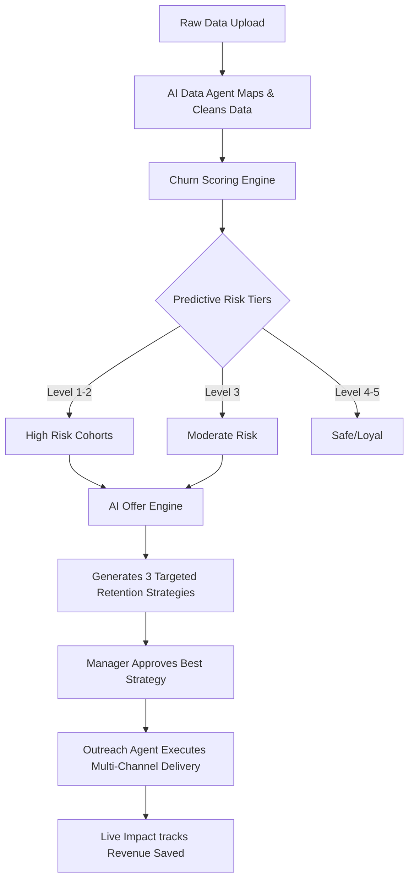

# Telecom Churn Prediction Platform

This document outlines the complete mechanics, value propositions, and systemic workflows of the AI-powered Telecom Churn Prediction Platform. It is divided into two parts: a **Business & Client-Facing Strategy** (Version 1) and a **Complete Technical Architecture** (Version 2).

---

## VERSION 1: Client Pitch & Business Overview (Non-Technical)

### 1. Problem Statement
In the highly competitive telecom sector, acquiring a new customer is significantly more expensive than retaining an existing one. Millions of dollars are lost annually to **Churn**—customers abandoning services for competitors. The primary challenges are:
* **Reactive instead of Proactive**: Companies only know a customer is unhappy when they call to cancel.
* **Lack of Context**: Standard analytics can guess *who* might leave, but rarely explain *why*.
* **Ineffective Retention**: Blanket promotions (e.g., "Give everyone 10% off") waste revenue on customers who didn't plan on leaving, while severely under-delivering for high-risk customers who need personalized care.

### 2. The Solution: AI-Powered Churn Prediction & Retention Agent
This product is an **end-to-end, proactive AI workforce**. It doesn't just predict who will leave; it autonomously understands *why*, instantly formulates the *best financial retention strategy*, and executes the *outreach* automatically.

**Why Use It?** Let an AI system analyze thousands of data points daily, detect subtle behavioral shifts, mathematically deduce churn probability, and save multi-million dollar revenue pipelines without expanding human headcount.

### 3. Core Features & Capabilities
* **Data Agent (Auto-Ingestion)**: Upload messy, raw customer data (billing, demographics, network usage). The AI agent instantly understands it, cleans it, and organizes it, bypassing the need for manual data entry mapping.
* **Deterministic Risk Scoring**: Mathematically ranks every subscriber on a 0-100 disruption scale. Customers are instantly tiered into Actionable Risk Levels (Level 1: Imminent Flight Risk -> Level 5: Highly Loyal).
* **AI Offer Engine**: An intelligent analyst that observes a risk cohort (e.g., Level 1, Price Sensitive) and generates highly strategic retention formulas (like matching a custom bundle with free streaming) that maximizes retention while preserving the company's profit margins.
* **Omnichannel Outreach Execution**: With one click, translates the AI's strategy into action via SMS, Email, WhatsApp, or routing to a Live Agent.
* **Live Financial Impact**: A real-time dashboard plotting actual dollars saved, offer acceptance rates, and tracking the ROI of the AI system itself.

### 4. Sequence of Processing & Workflow

### 5. Example Scenarios
**Scenario A: The Network Outage Victim**
* **The Situation**: A 5-year loyal customer experiences three slow-network events in a week.
* **How It Enhances Working**: The AI scores them "Level 2 Risk". The Offer Engine generates a strategy: *Do not give a discount; offer 3 months of Priority Network Boost to solve the root problem.* The Outreach module instantly sends an empathetic SMS with the claim link. The customer stays.

**Scenario B: The Price-Sensitive Demographic**
* **The Situation**: A cohort of 5,000 customers in a similar ZIP code are nearing their contract end.
* **How It Enhances Working**: The AI identifies them as "Price Sensitive". Instead of waiting for them to churn, the Offer Engine prescribes a *15% discount for 6 months*. Outreach queues the emails, saving an estimated 2,500 recurring subscriptions.

---

## VERSION 2: Technical Architecture & Engineering (Detailed)

This version details the autonomous agents, pipelines, stack, and data flow from the frontend to the backend engine.

### 1. Technology Stack
* **Frontend UI**: Next.js / React (TypeScript), highly interactive Dashboard.
* **Backend Framework**: Python FastAPI for high-performance, asynchronous microservice routing.
* **Relational Database (Core Data)**: PostgreSQL (`public.merged`, `Churn_New`). Houses rigid structural data: user demographics, precise transaction amounts, contract status, and deterministic churn scores.
* **Document Database (Campaign History)**: MongoDB (`offer_campaigns`, `campaign_executions`). Stores flexible, schema-less JSON payloads for dynamic LLM recommendations, historical snapshots, and messaging delivery states.
* **AI & LLM Orchestration**: LangChain wrapping Groq's high-speed inference endpoints (`openai/gpt-oss-120b`). Employs strictly typed prompt engineering returning purely structured JSON for the backend to ingest.

### 2. Autonomous Agents & Their Flows

#### A. The Data Agent (Ingestion & ETL Pipeline)
* **Goal**: Accept unstructured/semi-structured CSV data and map it to database taxonomy.
* **Flow**:
  1. Frontend uploads CSV -> Fast API `UploadFile`.
  2. Backend reads slice with Pandas.
  3. LLM is prompted with sample columns and asks to generate a mapping to DB fields.
  4. Backend Validator kicks in: It verifies the CSV against ML-Readiness thresholds (No null targets), duplicate flags, and structural errors.
  5. The valid data is shipped into Postgres.

#### B. The Churn Scoring Engine (Deterministic Math)
* **Goal**: Ensure the Churn Probability output is mathematically transparent.
* **Flow**:
  1. Once data represents in Postgres, raw features (Tenure, Monthly Charges, Service Issues) are fed into the prediction sequence.
  2. The algorithm calculates the core likelihood.
  3. Normalizes this into `Churn Score` (0 - 100).
  4. Resolves the abstract score into `Risk Level 1 through 5` corresponding directly to Outreach thresholds.

#### C. The Offer Engine Agent (LLM Strategy Module)
* **Goal**: Provide highly tailored, contextual action-plans that a human agent can deploy to save a cohort.
* **Flow**:
  1. User selects target conditions via UI (e.g., Main Category: "Price", Risk: "Level 1").
  2. Next.js calls `POST /offer-engine/recommendations`.
  3. The Backend queries Postgres to find all subscriber IDs mapping to those conditions.
  4. The LLM gets a constructed prompt featuring: (A) The Cohort summary, (B) Allowed Offer Types (Discount, Gaming, Points, Bundle), and (C) Request to output exactly 3 strategies.
  5. The LLM provides `projected_reduction_pct` and `projected_target_level` inside parsed JSON.
  6. Backend utilizes "Robust Fallback Logic"—if the LLM hallucinates or fails, Python executes default algorithmic retention plans seamlessly.

#### D. The Outreach & Execution Module
* **Goal**: Disburse the approved campaign to user devices and track costs.
* **Flow**:
  1. UI pushes `campaign_id` and `channels` (sms, whatsapp, etc.) to backend.
  2. Backend aggregates Volume counts, fetches per-channel Costs (`{"sms": 0.80, "whatsapp": 0.05}`) and updates the Campaign payload in MongoDB state to `notify_user: True`.
  3. An `execution_doc` is recorded for analytics, tracking real financial cost vs projected saved revenue metrics.

### 3. Frontend-to-Backend State Interaction
* **No Global Blockers**: The system manages local state efficiently. Database mappings like `enrich_offer_rows()` join Postgres User Identifiers (`Name`, `Email`, `Mobile`) with LLM payload generated Offers to bridge Relational Data and AI Data without expensive cross-database queries.
* **Asynchronicity**: The APIs return AI predictions quickly. Time-consuming processes (e.g. LLM querying, cohort DB fetches) run asynchronously so the Dashboard never blocks the user experience.
